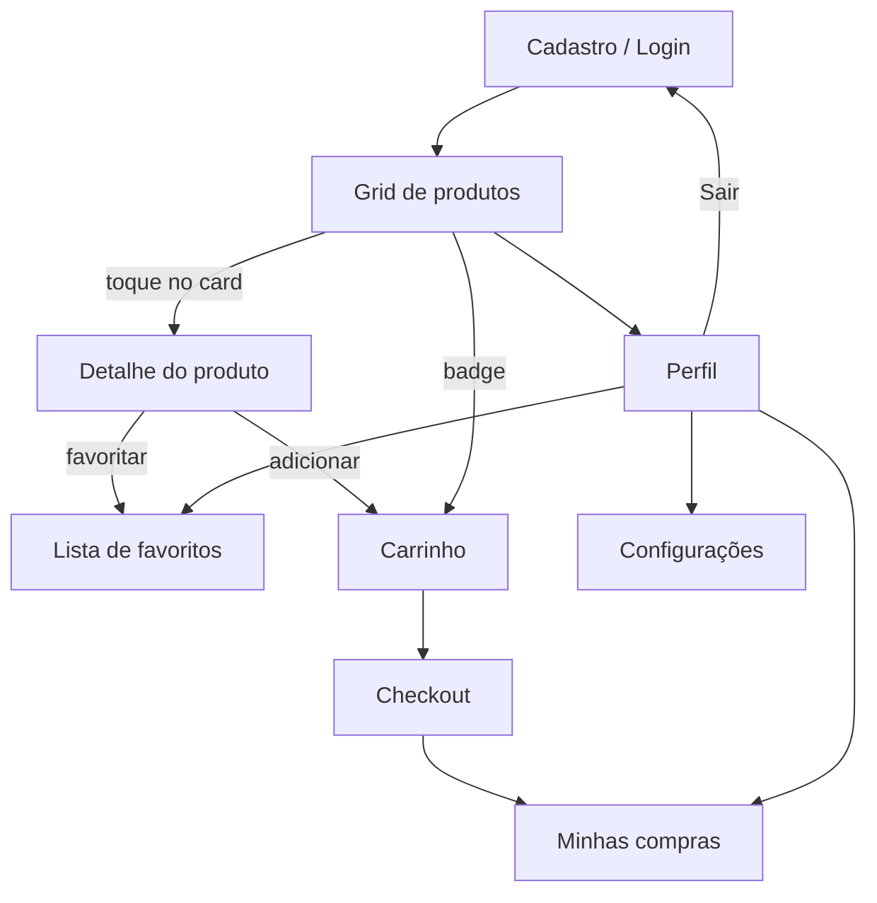

# Little Store

Loja simples full-stack para o usuário final: catálogo de produtos, carrinho, checkout e perfil. O front-end é um app **Flutter**; a API é **.NET 10 Minimal API** com **SQLite**, autenticação **JWT + refresh token** e documentação via **Scalar**.

## Sobre o projeto

| Camada | Tecnologia | Descrição |
|--------|------------|-----------|
| App | Flutter 3.12+ | Interface do cliente (login, produtos, carrinho, perfil) |
| API | .NET 10 Minimal API | Toda a lógica em um único [`Program.cs`](LittleStoreBackend/Program.cs) |
| Banco | SQLite + EF Core | Migrations automáticas; arquivo `little_store.db` |

## Estrutura do repositório

```
little_store/
├── LittleStoreBackend/          # API REST (.NET)
│   ├── Program.cs               # Entidades, DbContext, JWT, endpoints
│   ├── appsettings.json
│   └── Migrations/
└── little_store_app/            # App Flutter
    ├── lib/
    │   ├── main.dart
    │   └── src/
    │       ├── common/          # DI, rotas, HTTP, storage, patterns
    │       └── features/        # auth, products, cart, checkout, profile, orders, favorites, settings
    └── REFERENCE_CODE.md        # Padrões de arquitetura do app
```

## Pré-requisitos

- [.NET 10 SDK](https://dotnet.microsoft.com/download)
- [Flutter 3.12+](https://flutter.dev/docs/get-started/install)

## Como rodar

### Backend

```bash
cd LittleStoreBackend
dotnet run
```

| Recurso | URL |
|---------|-----|
| API | `http://localhost:5064` |
| Scalar (documentação interativa) | `http://localhost:5064/scalar/v1` |
| OpenAPI JSON | `http://localhost:5064/openapi/v1.json` |

O banco `little_store.db` é criado/atualizado via **EF Core migrations** na inicialização, com produtos de exemplo.

### App Flutter

```bash
cd little_store_app
flutter pub get
flutter run
```

**Base URL da API por plataforma** (configurada em `api_constant.dart`):

| Plataforma | URL |
|------------|-----|
| Web / Desktop / iOS | `http://localhost:5064` |
| Android Emulator | `http://10.0.2.2:5064` |

> O backend deve estar em execução antes de usar o app.

## Funcionalidades do app

### Autenticação
- Cadastro e login
- JWT + refresh token (renovação automática via `HttpService`)
- Logout (revoga refresh token no servidor)

### Produtos
- Grid com busca por nome ou descrição
- **Detalhe do produto** (toque no card): descrição completa, preço, datas
- Adicionar ao carrinho (grid ou detalhe)
- **Favoritar / remover favorito** no detalhe (ícone coração e botão)

### Carrinho e checkout
- Ícone do carrinho na AppBar com **badge** de quantidade
- Alterar quantidade, remover itens
- Checkout com resumo e confirmação da compra

### Perfil
- Nome, e-mail e **cliente desde** (data de cadastro)
- **Minhas compras** — histórico com **data da compra**
- **Favoritos** — lista de produtos favoritados
- Configurações (tema escuro) e **Sair**

### Navegação
- Via **AppBar** (sem bottom navigation)
- Produtos → carrinho (badge) / perfil
- Demais telas com botão voltar

## Fluxo do usuário



1. Cadastre-se ou faça login
2. Navegue pelos produtos (busca opcional)
3. Toque em um produto para ver **detalhes** e **favoritar**
4. Adicione itens ao carrinho e finalize a compra
5. Consulte **Minhas compras** (com data) e **Favoritos** no perfil
6. Saia quando desejar

## API resumida

Endpoints protegidos exigem header `Authorization: Bearer {accessToken}`.

### Auth (público)

| Método | Rota | Descrição |
|--------|------|-----------|
| POST | `/auth/register` | Cadastro `{ name, email, password }` |
| POST | `/auth/login` | Login `{ email, password }` |
| POST | `/auth/refresh` | Renovar tokens `{ refreshToken }` |
| POST | `/auth/logout` | Revogar refresh token |
| GET | `/auth/me` | Perfil do usuário logado |

### Produtos (autenticado)

| Método | Rota | Descrição |
|--------|------|-----------|
| GET | `/products?search=` | Listar / buscar |
| GET | `/products/{id}` | Detalhe |
| POST | `/products` | Criar |
| PUT | `/products/{id}` | Atualizar |
| DELETE | `/products/{id}` | Remover |

### Carrinho (autenticado)

| Método | Rota | Descrição |
|--------|------|-----------|
| GET | `/cart` | Listar itens + total |
| POST | `/cart/items` | Adicionar `{ productId, quantity }` |
| PUT | `/cart/items/{id}` | Atualizar quantidade |
| DELETE | `/cart/items/{id}` | Remover item |
| DELETE | `/cart` | Esvaziar carrinho |

### Pedidos (autenticado)

| Método | Rota | Descrição |
|--------|------|-----------|
| GET | `/orders` | Histórico (id, total, status, createdAt) |
| GET | `/orders/{id}` | Detalhe com itens |
| POST | `/orders/checkout` | Finalizar compra a partir do carrinho |

### Favoritos (autenticado)

| Método | Rota | Descrição |
|--------|------|-----------|
| GET | `/favorites` | Listar produtos favoritos |
| GET | `/favorites/{productId}` | Verificar `{ isFavorite }` |
| POST | `/favorites` | Adicionar `{ productId }` |
| DELETE | `/favorites/{productId}` | Remover favorito |

## Banco de dados (SQLite)

| Tabela | Campos principais |
|--------|-------------------|
| `Users` | id, name, email, password (BCrypt), createdAt |
| `Products` | id, name, description, price, createdAt, updatedAt |
| `CartItems` | id, userId, productId, quantity, createdAt |
| `Orders` | id, userId, total, status, createdAt |
| `OrderItems` | id, orderId, productId, productName, quantity, unitPrice |
| `Favorites` | id, userId, productId, createdAt |
| `RefreshTokens` | id, userId, token, expiresAt, revokedAt |

## Arquitetura do app Flutter

- **Feature-first:** cada funcionalidade em `lib/src/features/{nome}/` com `models`, `repositories`, `view_models`, `views`, `routes`
- **State management:** `ChangeNotifier` customizado (`StateManagement`, `AppState`, `Result`)
- **DI:** GetIt (`dependency_injector.dart`)
- **Rotas:** go_router com redirect por JWT
- **HTTP:** Dio com interceptor de refresh token
- **Convenção de UI:** callbacks `onPressed` / `onTap` sempre como `() { ... }`

Consulte [`little_store_app/REFERENCE_CODE.md`](little_store_app/REFERENCE_CODE.md) para exemplos e padrões detalhados.

## Backend

- **Minimal API monolítica:** entidades, `DbContext`, serviços JWT e todos os endpoints estão em [`LittleStoreBackend/Program.cs`](LittleStoreBackend/Program.cs)
- **Scalar** disponível em Development para testar a API
- **CORS** habilitado para integração com Flutter web/mobile

## License

MIT License

Copyright (c) 2026 William Franco

Permission is hereby granted, free of charge, to any person obtaining a copy
of this software and associated documentation files (the "Software"), to deal
in the Software without restriction, including without limitation the rights
to use, copy, modify, merge, publish, distribute, sublicense, and/or sell
copies of the Software, and to permit persons to whom the Software is
furnished to do so, subject to the following conditions:

The above copyright notice and this permission notice shall be included in all
copies or substantial portions of the Software.

THE SOFTWARE IS PROVIDED "AS IS", WITHOUT WARRANTY OF ANY KIND, EXPRESS OR
IMPLIED, INCLUDING BUT NOT LIMITED TO THE WARRANTIES OF MERCHANTABILITY,
FITNESS FOR A PARTICULAR PURPOSE AND NONINFRINGEMENT. IN NO EVENT SHALL THE
AUTHORS OR COPYRIGHT HOLDERS BE LIABLE FOR ANY CLAIM, DAMAGES OR OTHER
LIABILITY, WHETHER IN AN ACTION OF CONTRACT, TORT OR OTHERWISE, ARISING FROM,
OUT OF OR IN CONNECTION WITH THE SOFTWARE OR THE USE OR OTHER DEALINGS IN THE
SOFTWARE.
