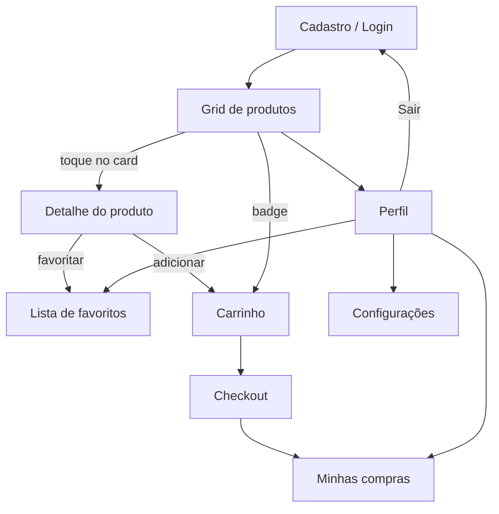

# Little Store

Loja simples full-stack para o usuário final: catálogo de produtos, carrinho, checkout e perfil. O front-end é um app **Flutter**; a API é **.NET 10 Minimal API** com **SQLite**, autenticação **JWT + refresh token** e documentação via **Scalar**.

## Sobre o projeto

| Camada | Tecnologia | Descrição |
|--------|------------|-----------|
| App | Flutter 3.12+ | Interface do cliente (login, produtos, carrinho, perfil) |
| API | .NET 10 Minimal API | REST monolítica com JWT, carrinho, pedidos e favoritos |
| Banco | SQLite + EF Core | Migrations automáticas; arquivo `little_store.db` |

## Estrutura do monorepo

```
little_store/
├── LittleStoreBackend/     → [README do backend](LittleStoreBackend/README.md)
└── little_store_app/       → [README do app](little_store_app/README.md)
```

Documentação complementar:

| Documento | Conteúdo |
|-----------|----------|
| [`little_store_app/README.md`](little_store_app/README.md) | Arquitetura Flutter, testes, coverage, screenshots |
| [`LittleStoreBackend/README.md`](LittleStoreBackend/README.md) | Pacotes, migrations, execução e URLs da API |
| [`little_store_app/REFERENCE_CODE.md`](little_store_app/REFERENCE_CODE.md) | Padrões de código do app |

## Pré-requisitos

- [.NET 10 SDK](https://dotnet.microsoft.com/download)
- [Flutter 3.12+](https://flutter.dev/docs/get-started/install)

## Quick start

### 1. Backend

```bash
cd LittleStoreBackend
dotnet run
```

A API sobe em `http://localhost:5064`. O banco é criado/atualizado automaticamente via EF Core migrations, com produtos de exemplo.

Para migrations, pacotes e documentação interativa (Scalar), consulte [`LittleStoreBackend/README.md`](LittleStoreBackend/README.md).

### 2. App Flutter

```bash
cd little_store_app
flutter pub get
flutter run
```

> O backend deve estar em execução antes de usar o app.

Para arquitetura, testes e coverage, consulte [`little_store_app/README.md`](little_store_app/README.md).

## Integração app ↔ API

Base URL configurada em `little_store_app/lib/src/common/constants/api_constant.dart`:

| Plataforma | URL |
|------------|-----|
| Web / Desktop / iOS | `http://localhost:5064` |
| Android Emulator | `http://10.0.2.2:5064` |

O app consome a API REST do backend. Endpoints, autenticação e schema do banco estão documentados no [README do backend](LittleStoreBackend/README.md) e na interface Scalar (`http://localhost:5064/scalar/v1`).

## Funcionalidades

### Autenticação
- Cadastro, login e logout
- Sessão com JWT + refresh token

### Produtos
- Grid com busca por nome ou descrição
- Detalhe do produto (toque no card)
- Adicionar ao carrinho e favoritar

### Carrinho e checkout
- Badge de quantidade na AppBar
- Alterar quantidade, remover itens e finalizar compra

### Perfil
- Dados do usuário e data de cadastro
- Minhas compras (histórico com data da compra)
- Favoritos e configurações (tema escuro)

### Navegação
- Via AppBar (sem bottom navigation)
- Produtos → carrinho / perfil; demais telas com botão voltar

## Fluxo do usuário



1. Cadastre-se ou faça login
2. Navegue pelos produtos (busca opcional)
3. Toque em um produto para ver detalhes e favoritar
4. Adicione itens ao carrinho e finalize a compra
5. Consulte Minhas compras e Favoritos no perfil
6. Saia quando desejar

## Examples of commits

```
git add . && git commit -m ":rocket: Initial commit." && git push
git add . && git commit -m ":building_construction: Added initial project architecture." && git push
git add . && git commit -m ":building_construction: Update project architecture." && git push
git add . && git commit -m ":memo: Updated project documentation." && git push
git add . && git commit -m ":memo: Updated code documentation." && git push
git add . && git commit -m ":white_check_mark: Added feature xyz." && git push
git add . && git commit -m ":wrench: Fixed xyz usage." && git push
git add . && git commit -m ":heavy_minus_sign: Removed xyz." && git push
git add . && git commit -m ":memo: Adjusted project imports." && git push
git add . && git commit -m ":arrow_up: Updated dependencies." && git push
git add . && git commit -m ":arrow_down: Removed dependencies." && git push
git add . && git commit -m ":wastebasket: Removed unused code." && git push
git add . && git commit -m ":test_tube: Added test functionality xyz." && git push
git add . && git commit -m ":construction_worker: Building in progress." && git push
git add . && git commit -m ":construction_worker: Added CI build system." && git push
```

## License

MIT License

Copyright (c) 2026 William Franco

Permission is hereby granted, free of charge, to any person obtaining a copy
of this software and associated documentation files (the "Software"), to deal
in the Software without restriction, including without limitation the rights
to use, copy, modify, merge, publish, distribute, sublicense, and/or sell
copies of the Software, and to permit persons to whom the Software is
furnished to do so, subject to the following conditions:

The above copyright notice and this permission notice shall be included in all
copies or substantial portions of the Software.

THE SOFTWARE IS PROVIDED "AS IS", WITHOUT WARRANTY OF ANY KIND, EXPRESS OR
IMPLIED, INCLUDING BUT NOT LIMITED TO THE WARRANTIES OF MERCHANTABILITY,
FITNESS FOR A PARTICULAR PURPOSE AND NONINFRINGEMENT. IN NO EVENT SHALL THE
AUTHORS OR COPYRIGHT HOLDERS BE LIABLE FOR ANY CLAIM, DAMAGES OR OTHER
LIABILITY, WHETHER IN AN ACTION OF CONTRACT, TORT OR OTHERWISE, ARISING FROM,
OUT OF OR IN CONNECTION WITH THE SOFTWARE OR THE USE OR OTHER DEALINGS IN THE
SOFTWARE.
